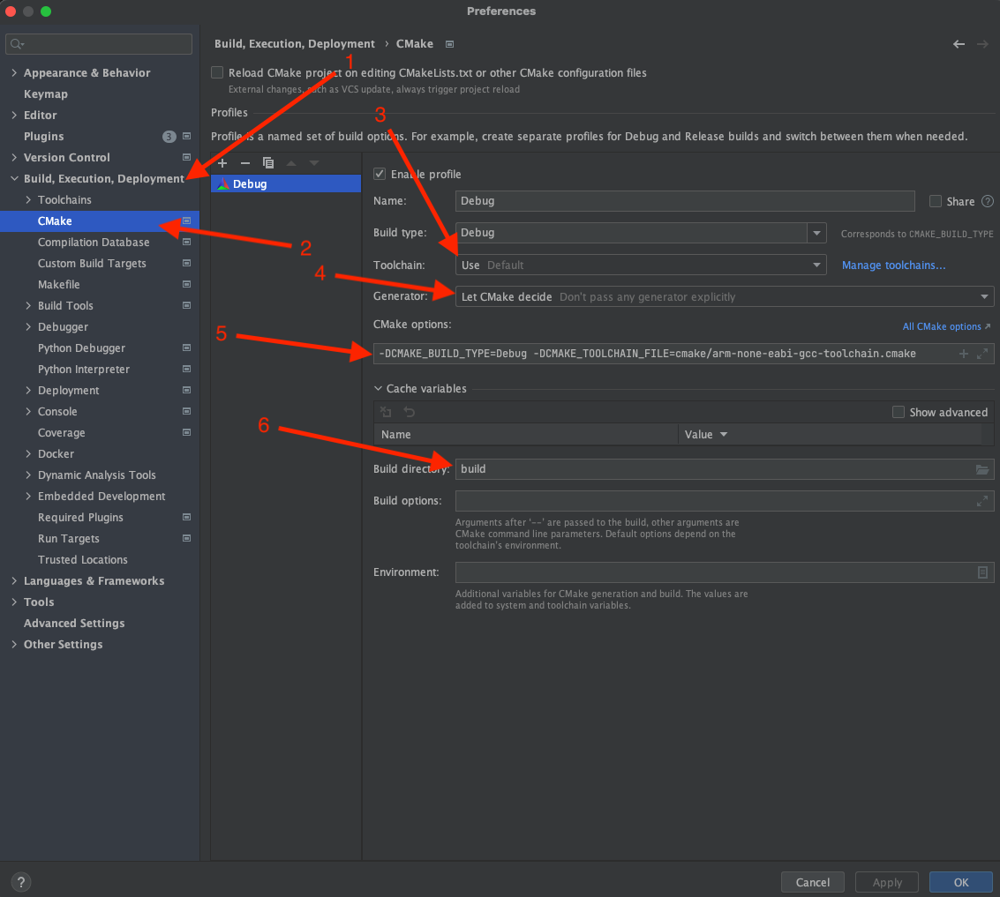
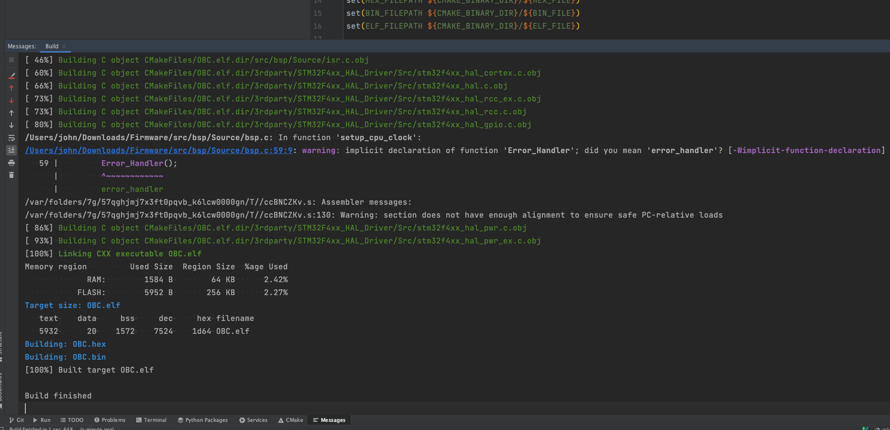

# About

Firmware for Absolute Chad project by PWr Aerospace.

Currently, configured for STM32F401CCU6 STM32 BlackPill.

PCB design for the project available [here](https://github.com/Aerospace-ASP/Hardware).

# Building step-by-step

Supported development platforms: Linux, macOS
*NOTE*: Windows is not supported for this project

## Install dependencies

`Ubuntu`/`Debian`:

```bash
sudo apt-get update && sudo apt-get install -y gcc-arm-none-eabi cmake git stlink-tools lbzip2 wget curl clang-format clang-tidy openocd minicom
```

`macOS` (assuming [brew](https://brew.sh/) is already installed):

```bash
brew install --cask gcc-arm-embedded && brew install stlink cmake clang-format llvm minicom openocd && \
ln -s "$(brew --prefix llvm)/bin/clang-format" "/usr/local/bin/clang-format" && \
ln -s "$(brew --prefix llvm)/bin/clang-tidy" "/usr/local/bin/clang-tidy" && \
ln -s "$(brew --prefix llvm)/bin/clang-apply-replacements" "/usr/local/bin/clang-apply-replacements"
```

If you are on either Linux or macOS but do not wish to use your package manager to download the compiler you can use this script:

```bash
./toolchain/setup_arm_gcc.sh
```

## Get the code

First you need to download the source code. To avoid any problems with authentication you should first add you SSH key to GitHub by following [this official tutorial](https://docs.github.com/en/authentication/connecting-to-github-with-ssh/adding-a-new-ssh-key-to-your-github-account).

After that `clone` the repository:

```bash
git clone git@github.com:Aerospace-ASP/Firmware.git
```

Change into the directory:

```bash
cd Firmware
```

## Building using GCC

You need to use the provided toolchain file and define the build type (Debug or Release) when configuring the build with cmake:

```bash
mkdir build && \
cd build && \
cmake -DCMAKE_BUILD_TYPE=Debug -DCMAKE_TOOLCHAIN_FILE=../cmake/arm-none-eabi-gcc-toolchain.cmake .. && \
make -j`nrpoc`
```

**IMPORTANT** When working make sure you change to your branch on which you are working using this command:

```bash
git checkout branch_name
```

## IDE using

If you know what you are doing you can use any IDE you want but we do not guarantee that you will have full support. If you want that guarantee you can use [CLion](https://www.jetbrains.com/clion/) it is free to use for students.

Run CLion and load project

1. CMake -> CMake Settings

    * Set CMake Options `-DCMAKE_BUILD_TYPE=Debug -DCMAKE_TOOLCHAIN_FILE=cmake/arm-none-eabi-gcc-toolchain.cmake`
    * Set build directory to build

    

    You can try to build the project by clicking the hammer icon:

    

    The result should look something like this. The `.elf` and `.bin` files are the actual results of compilation we care about:



2. Check if the debug configuration is correct, it should look like this:

    

3. Click two times on `prj/openocd/clion_debug_cfg.run/openocd debug & run.run.xml` and load it (right-hand side)

4. Click the bug and enjoy!

When you finished - commit changes on own branch only! NOT on master! If you want to merge - make pull request

<!-- ## Future toolchain improvements

<https://github.com/ucgosupl/stm32f4_template>

to installl
lbzip2 cmake -->

# Additional

Docker images for development are available on Docker Hub here:

* <https://hub.docker.com/repository/docker/john15321/stm-development>
* <https://hub.docker.com/repository/docker/john15321/stm-development-arm64>
* <https://hub.docker.com/repository/docker/john15321/stm-development-amd64>
