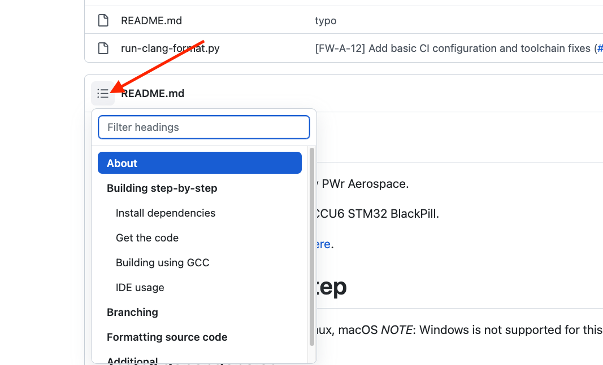
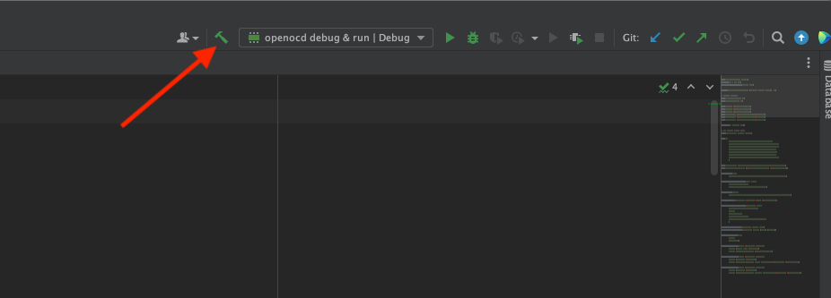
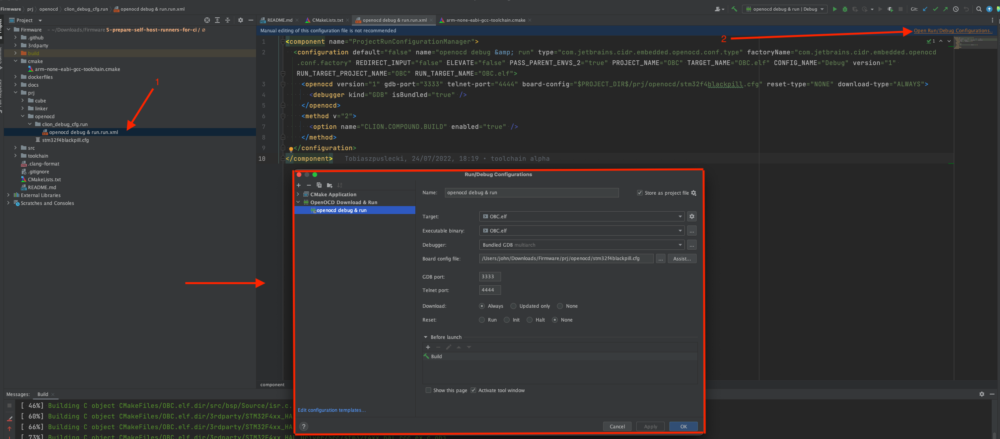
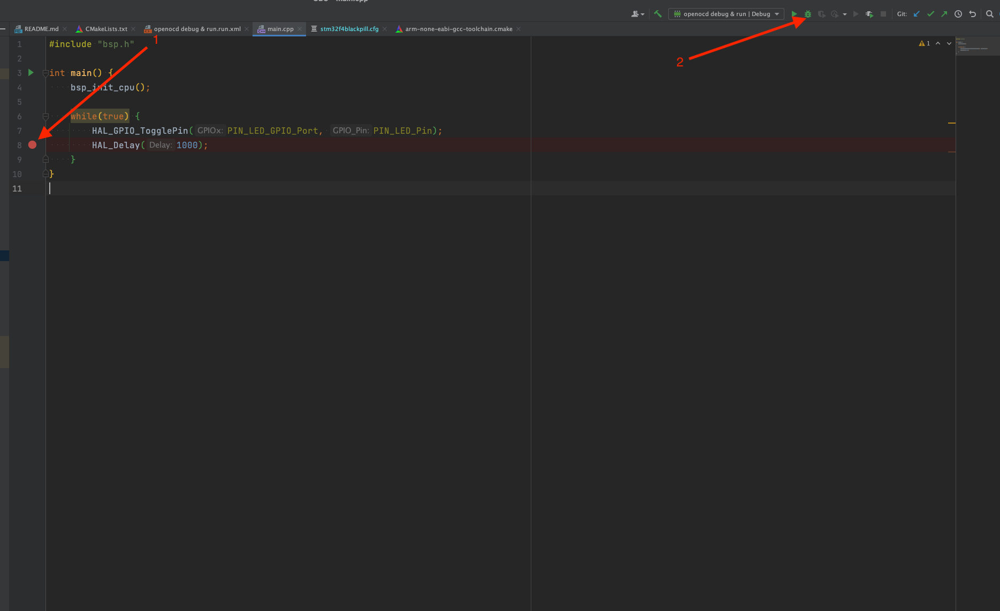
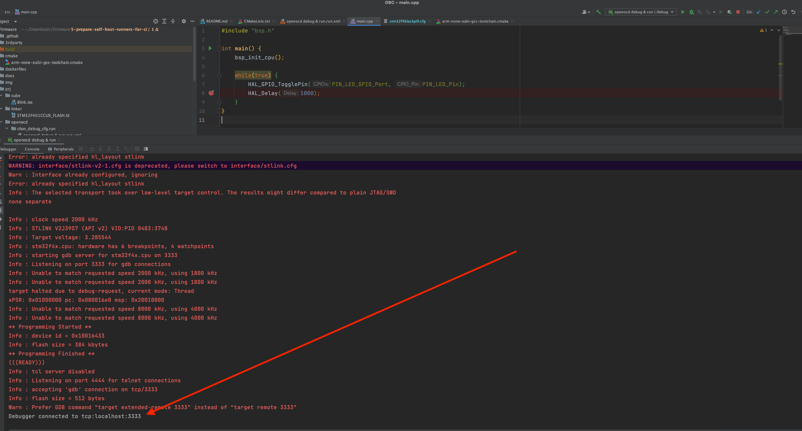
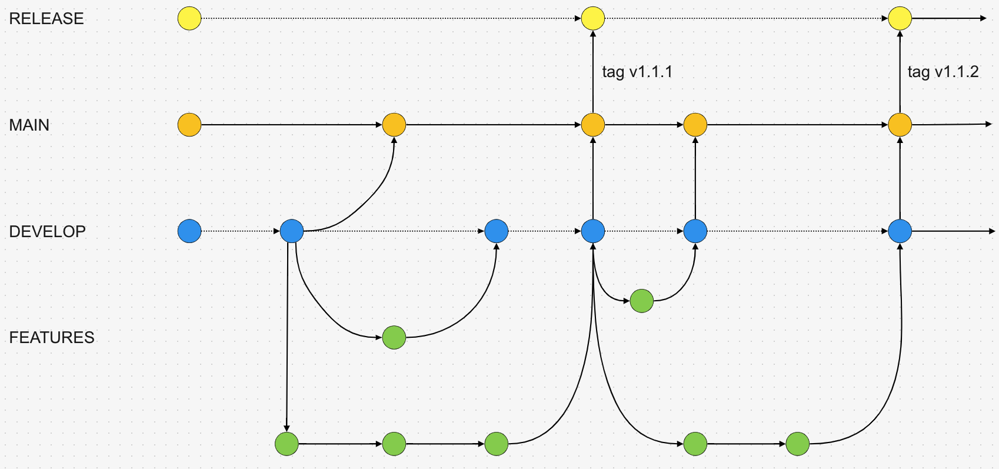
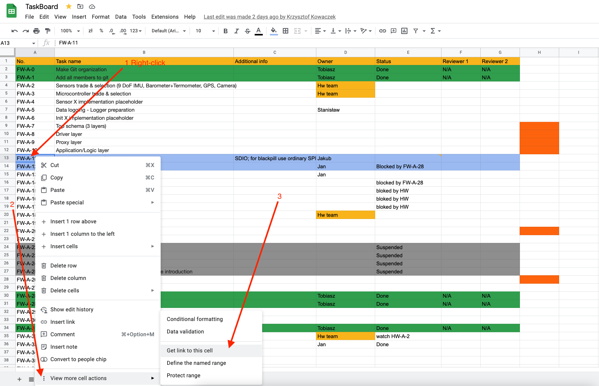
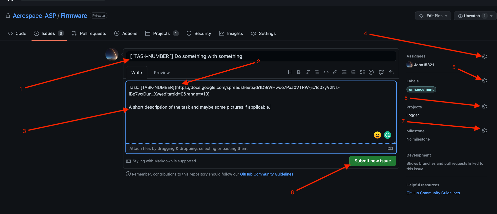
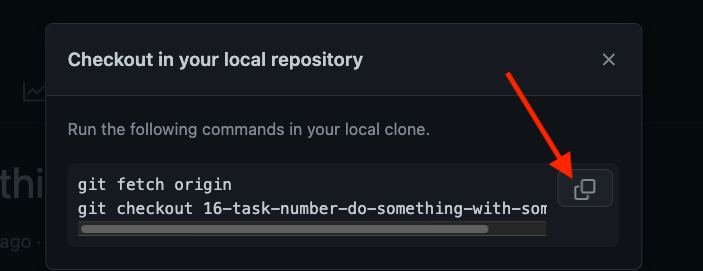

# About

Firmware for Absolute Chad project by PWr Aerospace.

Currently, configured for STM32F401CCU6 STM32 BlackPill.

PCB design for the project available [here](https://github.com/Aerospace-ASP/Hardware).

# Table of Contents

For a table of contents of the README click the button:



# Building step-by-step

Supported development platforms: Linux, macOS
*NOTE*: Windows is not supported for this project

## Install dependencies

`Ubuntu`/`Debian`:

```bash
sudo apt-get update && sudo apt-get install -y gcc-arm-none-eabi cmake git stlink-tools lbzip2 wget curl clang-format clang-tidy openocd minicom
```

`macOS` (assuming [brew](https://brew.sh/) is already installed):

```bash
brew install --cask gcc-arm-embedded && brew install stlink cmake clang-format llvm minicom openocd && \
ln -s "$(brew --prefix llvm)/bin/clang-format" "/usr/local/bin/clang-format" && \
ln -s "$(brew --prefix llvm)/bin/clang-tidy" "/usr/local/bin/clang-tidy" && \
ln -s "$(brew --prefix llvm)/bin/clang-apply-replacements" "/usr/local/bin/clang-apply-replacements"
```

If you are on either Linux or macOS but do not wish to use your package manager to download the compiler you can use this script:

```bash
./toolchain/setup_arm_gcc.sh
```

## Get the code

First you need to download the source code. To avoid any problems with authentication you should first add you SSH key to GitHub by following [this official tutorial](https://docs.github.com/en/authentication/connecting-to-github-with-ssh/adding-a-new-ssh-key-to-your-github-account).

After that `clone` the repository:

```bash
git clone git@github.com:Aerospace-ASP/Firmware.git
```

Change into the directory:

```bash
cd Firmware
```

## Building using GCC

You need to use the provided toolchain file and define the build type (Debug or Release) when configuring the build with cmake:

```bash
mkdir build && \
cd build && \
cmake -DCMAKE_BUILD_TYPE=Debug -DCMAKE_TOOLCHAIN_FILE=../cmake/arm-none-eabi-gcc-toolchain.cmake ..
```

Now a `Makefile` should be generated, which you can use to actually build the project by running it (the `-jnrproc` part simply tell the compiler that it can use all of your cores to speed up the compilation):

```bash
make -j`nrpoc`
```

**IMPORTANT** When working make sure you change to your branch on which you are working using this command:

```bash
git checkout branch_name
```

## IDE usage

If you know what you are doing you can use any IDE you want but we do not guarantee that you will have full support. If you want that guarantee you can use [CLion](https://www.jetbrains.com/clion/) it is free to use for students.

Run CLion and load project

1. CMake -> CMake Settings
    * Set CMake Options `-DCMAKE_BUILD_TYPE=Debug -DCMAKE_TOOLCHAIN_FILE=cmake/arm-none-eabi-gcc-toolchain.cmake`
    * Set build directory to build

    

    You can try to build the project by clicking the hammer icon:

    

    The result should look something like this. The `.elf` and `.bin` files are the actual results of compilation we care about:


2. Check if the debug configuration is correct, it should look like this:

    

3. Click two times on `prj/openocd/clion_debug_cfg.run/openocd debug & run.run.xml` and load it (right-hand side)

4. Go to some code and create a breakpoint, click the debug symbol:

    

5. CLion should start `openocd` and start remote debugging on the STM:

    


*NOTE*: If you encounter any issues with/errors saying that `interface/stlink.cfg` cannot
be found go into the `prj/openocd/stm32f4blackpill.cfg` (or a different local `.cfg` file
according to which board you are trying to use) and comment out the current `source`
command for the `stlink.cfg` and uncomment another so that it searches for a
different configuration file (it simply can be names slightly differently on your system).

Now you should have a working setup for development.

# Branching

## The branching strategy

The branching strategy looks like this:

The short description of the branching strategy is as follows. The feature branches are a category of branches that branch out of the `develop` branch. A person branches out from develop, works on a given feature on their branch and when the feature is ready they submit a Pull Request to merge again into the develop branch. After the review process is finished the commits from the branch should be squashed and then merged into `develop` (GitHubs webUI provides that). Therefore each commit that lands on the `develop` branch is an addition of a feature, documentation but etc.. When an arbitrary set of new features is completed and could be deemed as a new release (release cycle should follow the [semver](https://semver.org/) convention) it should be merged into `main` (of course it should also follow the process of a Pull Request and reviews) when it is merged into `main` additional testing (for example flashing the actual hardware with the source code etc), validation etc. should be done. If the state of the code is deemed safe and proper it should be released as a new version of the software. This should be done by tagging which marks a given commit a release candidate which should automatically trigger a series of CI/CD checks and if they succeed the commit will be merged into the `release` branch and the software package will be finally released.



## Creating a task

TL;DR

If you want to work on something create an issue for that. And fill it out like this:
(example issue: <https://github.com/Aerospace-ASP/Firmware/issues/6>)

1. Fill out the name for the issue
2. Make sure you add a link to the task from the task board. Here is how you can get that link:
    
3. Provide a description for the task and what are your plans etc.
4. If you know you will be working on that task assign yourself
5. Add applicable labels to the task, e.g. if you are solving a bug then add `Bug`, if adding a new functionality add `enhancement` etc.
6. Assign the task to the `Logger` project
7. If applicable assign the task to a given milestone
8. Submit the issue/task



## Creating a branch and using it

Then when you have created an issue for you task click the `Create new branch` in the lower right corner:


Click on the `Change branch source`, then:

1. Make sure that the actual branch name is concise and fairly short
2. *Make sure that you branch out from the `develop` branch!*
3. Make sure `Checkout locally` is selected
4. Click the create branch button


Now a branch has been created for you, copy the commands needed for you to use it:



In you cloned repository open a terminal and paste the copied commands. Now you should be on your newly created branch and you can start working. To make sure you are on that branch run:

```bash
$ git branch
* 16-task-number-do-something-with-something
...
```

The branch on which you currently reside will be marked with a `*`.
Next simply keep working on your branch, push commits, and when you think you are ready create a Pull Request.

<!-- ## Future toolchain improvements

<https://github.com/ucgosupl/stm32f4_template>

to installl
lbzip2 cmake -->

<!-- ## Future toolchain improvements

<https://github.com/ucgosupl/stm32f4_template>

to installl
lbzip2 cmake -->

# Formatting source code

To locally check if the source code is formatted properly:

```bash
./run-clang-format.py -r src --exclude src/bsp
```

To format something:

```bash
clang-format -i /src/main.cpp
```

# Additional

Docker images for development are available on Docker Hub here:

* <https://hub.docker.com/repository/docker/john15321/stm-development>
* <https://hub.docker.com/repository/docker/john15321/stm-development-arm64>
* <https://hub.docker.com/repository/docker/john15321/stm-development-amd64>
